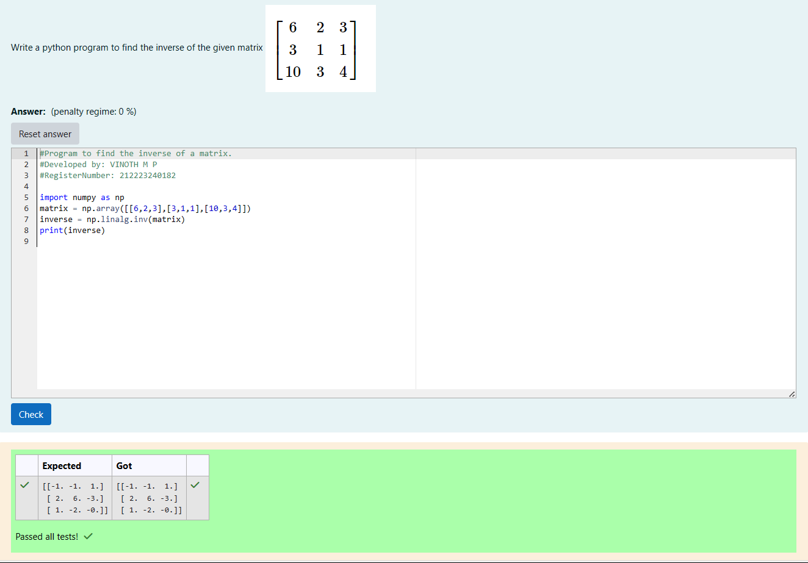

# INVERSE-OF-A-MATRIX
## Aim:
To write a python program to find the inverse of a matrix
## Equipment’s required:
1. 	Hardware – PCs
2. 	Anaconda – Python 3.7 Installation / Moodle-Code Runner
## Algorithm:
### Step1 : import numpy as np
### Step 2: store the matrix in a variable using np.array
### Step 3: find the inverse of the matix using np.linalg.inv and store it in a varible
### Step 4:print the inverse matrix using print function 

## Program:
```
#Program to find the inverse of a matrix.
#Developed by: VINOTH M P
#RegisterNumber: 212223240182

import numpy as np
matrix = np.array([[6,2,3],[3,1,1],[10,3,4]])
inverse = np.linalg.inv(matrix)
print(inverse)
```
## Output:

## Result:
Thus the inverse of given matrix is successfully solved using python program

